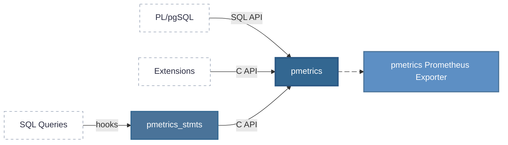

# pmetrics

pmetrics is a PostgreSQL extension that provides a metrics collection infrastructure for Postgres. It implements counters, gauges, and histograms with JSONB labels, stored in dynamic shared memory and queryable via SQL.



## Components

### pmetrics (Core Extension)

Provides the metrics collection infrastructure. Extensions record metrics via the C API, PL/pgSQL functions can use the SQL API.

[Documentation](https://v0idpwn-industries.github.io/pmetrics/)

### pmetrics_stmts (Query Tracking Extension)

A pg_stat_statements alternative built on top of pmetrics. Tracks query performance metrics (planning time, execution time, rows returned, blocks hit) as histograms.

[Documentation](pmetrics_stmts/README.md)

### pmetrics Prometheus Exporter

Service that queries PostgreSQL and exports metrics in Prometheus text exposition format.

[Documentation](prometheus_exporter/README.md)

## Installation

### PostgreSQL Extensions

Build and install both extensions:

```bash
PG_CONFIG=/path/to/pg_config make clean
PG_CONFIG=/path/to/pg_config make pmetrics.all
PG_CONFIG=/path/to/pg_config make pmetrics.install
PG_CONFIG=/path/to/pg_config make pmetrics_stmts.all
PG_CONFIG=/path/to/pg_config make pmetrics_stmts.install
```

Add to `postgresql.conf`:

```ini
# Core metrics only
shared_preload_libraries = 'pmetrics'

# Core metrics + query tracking
shared_preload_libraries = 'pmetrics,pmetrics_stmts'
compute_query_id = on  # Required for pmetrics_stmts query tracking
```

Restart PostgreSQL and create extensions:

```sql
CREATE EXTENSION pmetrics;
CREATE EXTENSION pmetrics_stmts;  -- optional
```

### Prometheus Exporter

```bash
cd prometheus_exporter
go build -o pmetrics-exporter
DATABASE_URL=postgresql:///mydb ./pmetrics-exporter
```

## Using pmetrics from other extensions

The `examples/pmetrics_txn/` directory contains a minimal example extension demonstrating how to integrate with pmetrics. It tracks PostgreSQL transactions (commits and aborts).

## Requirements

- PostgreSQL 17 or later
- C compiler for building extensions

## License

MIT
